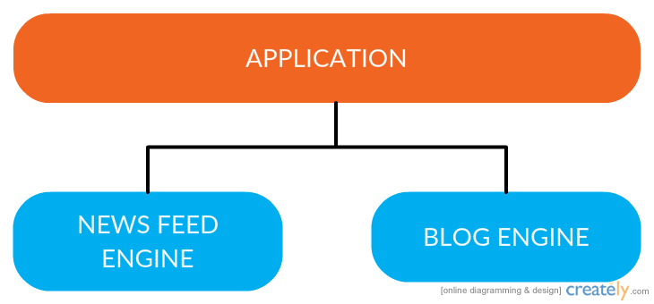

# What Are Engines?

While a lot of developers know the term "Engine", there is often a lot of unfamiliarity with what that term actually means. So, let us take a moment and make sure we are all on the same page before diving into building an Engine.

## What Engines Are Conceptually

The summary from the [Engines RFC](https://github.com/emberjs/rfcs/blob/master/text/0010-engines.md) states that Engines are constructs that:

> ...allow multiple logical applications to be composed together into a single application from the user's perspective.

The key term here is "logical application". That is, an Engine represents a set of functionality and user experiences that could logically be considered an application. However, they differ from normal Ember applications in that they are intended to be composed within a parent application in order to create a single, cohesive user experience.

The oft used example of this is a "blogging" application. While a blog itself could be a full-fledged application, you may also wish to use it as a specific subsection of your overall application. If you threw a "news feed" engine into that mix, you might get an application sturcture that looks something like this:

Even though the application has sets of functionality represented by Engines, there is room for some additional functionality that the host application itself provides.

## How Engines Differ From Applications

Now that we can understand what Engines represent conceptually (that is, "logical applications"), let's talk about the concrete differences between Applications and Engines. Again, from the Engines RFC:

> The primary differences [between Applications and Engines] are that an engine does not boot itself and an engine does not control the router.

Other than those two differences, Engines are remarkably similar to Applications; they have their own container, registry, context, and namespace. We'll dive into those aspects more later, but for now it is important to understand that Engines are more-or-less just applications that need a "consumer" to boot them up and handle routing. In fact, you can think of an Application as a specific type of Engine that adds in the above features.

In addition to the two differences above, which are primarily concerned with runtime behavior, there is also a build time difference to keep in mind. That is, Engines are packaged and distributed as Ember-CLI Addons and not as Ember-CLI Applications.
